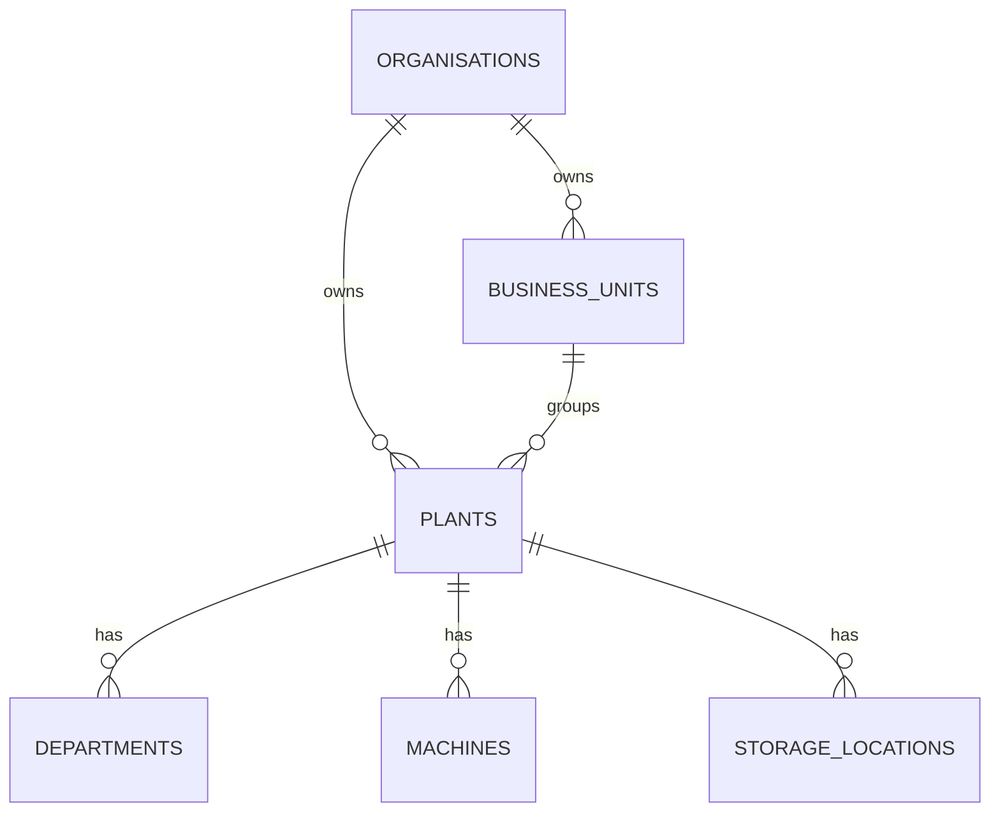

# CrusherMitra AI Database Design

## 1. Database Goals

The database must support multi-tenant SaaS operations for stone crushers, quarries, RMC plants, transport, quality, maintenance, compliance, documents, AI, IoT, and platform administration.

Primary goals:

- Strong tenant isolation.
- Normalised operational records.
- Immutable ledgers for stock and audit-sensitive activity.
- Database transactions for critical workflows.
- Configurable compliance, permissions, units, pricing, and plan limits.
- PostGIS support for plant, customer site, dispatch, and GPS data.
- pgvector support for organisation-scoped document retrieval.

## Current Implementation Status

The repository contains an initial SQL foundation at `packages/database/migrations/0001_foundation.sql`. It creates selected tenancy, identity, product, inventory, weighbridge, audit, AI, knowledge, and device tables, plus initial indexes and several RLS policies.

This migration is not the complete production schema. Later phases must add the remaining module tables, complete organisation-scoped constraints, expand `with check` RLS policies for writes, add repository-level transaction helpers, and execute the migration against local PostgreSQL before claiming database functionality works.

## 2. Database Technology

- PostgreSQL as the system of record.
- PostGIS for geography fields.
- pgvector for document and knowledge retrieval.
- Row-Level Security where practical.
- Redis for cache, queues, rate limits, and idempotency windows.
- Alembic for the FastAPI service migrations if it owns Python-specific tables. Prefer one migration owner for shared operational tables to avoid drift.

## 3. Multi-Tenant Hierarchy

Rules:

- Every tenant-owned table must include `organisation_id`.
- Plant-specific records must include `plant_id` where applicable.
- Client requests must not be trusted for organisation context.
- Server session determines accessible organisations and plants.
- Organisation-scoped uniqueness should be implemented with composite unique indexes such as `(organisation_id, code)`.

## 4. Common Columns

Tenant-owned business tables should generally include:

- `id`
- `organisation_id`
- `plant_id`, nullable only when a record is not plant-specific
- `created_at`
- `updated_at`
- `created_by_user_id`
- `updated_by_user_id`
- `deleted_at`
- `deleted_by_user_id`
- `approval_status`, where approval applies
- `approved_by_user_id`, where approval applies
- `approved_at`, where approval applies
- `version`, for optimistic concurrency

Do not physically delete important business records. Use soft deletion with audit logs.

## 5. Entity Relationship Design

### Platform And Tenancy

Tables:

- `organisations`
- `organisation_settings`
- `business_units`
- `subscription_plans`
- `subscriptions`
- `plants`
- `plant_settings`
- `departments`
- `feature_flags`

Relationships:

- Organisation owns users through memberships.
- Organisation owns plants and settings.
- Subscription references plan and organisation.
- Feature flags can apply globally, by plan, organisation, or plant.

### Identity And Access

Tables:

- `users`
- `memberships`
- `roles`
- `permissions`
- `role_permissions`
- `membership_roles`
- `user_plant_access`
- `sessions`
- `login_history`

Relationships:

- User may belong to many organisations through memberships.
- Membership may have many roles.
- Plant access restricts plant-scoped operations.

### Masters

Tables:

- `customers`
- `customer_sites`
- `suppliers`
- `products`
- `product_units`
- `product_unit_conversions`
- `product_prices`
- `tax_codes`
- `storage_locations`
- `machines`
- `machine_components`
- `vehicles`
- `drivers`
- `employees`
- `shifts`

Relationships:

- Customer has many sites and price rules.
- Product belongs to a category and has configurable purchase, base, and sales units.
- Vehicles and drivers can be organisation-owned or linked to suppliers.

### Sales

Tables:

- `quotations`
- `quotation_items`
- `sales_orders`
- `sales_order_items`
- `order_amendments`
- `customer_price_lists`

Relationships:

- Sales order references customer, site, product lines, plant, and approval state.
- Amendments retain old and new values.

### Purchases

Tables:

- `purchase_orders`
- `purchase_order_items`
- `purchase_receipts`
- `purchase_receipt_items`
- `supplier_bills`

Relationships:

- Receipt can reference weighment, supplier, product, and stock transaction.
- Supplier bill references receipt items and creates payable ledger entries.

### Operations

Tables:

- `crusher_production_runs`
- `crusher_production_outputs`
- `downtime_events`
- `rmc_mix_designs`
- `rmc_mix_design_revisions`
- `rmc_batches`
- `rmc_batch_ingredients`
- `moisture_readings`

Relationships:

- Crusher run consumes raw stock and creates output stock through inventory transactions.
- RMC batch references approved mix-design revision and consumes ingredients.
- Approved mix-design revisions are immutable.

### Inventory

Tables:

- `inventory_transactions`
- `inventory_balances`
- `stock_counts`
- `stock_count_items`
- `internal_transfers`
- `internal_transfer_items`

Design:

- `inventory_transactions` is the immutable stock ledger.
- `inventory_balances` is a derived/cache table maintained transactionally from ledger entries.
- Manual edits to current stock are forbidden.

### Weighbridge

Tables:

- `weighbridges`
- `weighments`
- `weighment_images`
- `weighment_corrections`
- `weighbridge_devices`

Design:

- First and second weights are captured as separate timestamped facts.
- Corrections never overwrite original values.
- Device, source mode, operator, images, printed status, and manual edit flags are retained.

### Dispatch

Tables:

- `dispatches`
- `dispatch_items`
- `trips`
- `trip_events`
- `delivery_proofs`
- `vehicle_locations`

Design:

- Dispatch can be linked to sales orders, weighments, RMC batches, trips, invoices, and delivery proof.
- GPS and event records are append-only.

### Quality

Tables:

- `quality_test_definitions`
- `quality_specifications`
- `quality_samples`
- `quality_test_results`
- `cube_samples`
- `cube_test_results`
- `non_conformances`
- `corrective_actions`

Design:

- Failed tests can create alerts and non-conformance records.
- Test definitions and specifications are configurable by product, plant, customer, grade, and organisation.

### Maintenance

Tables:

- `maintenance_plans`
- `maintenance_tasks`
- `work_orders`
- `work_order_parts`
- `breakdowns`
- `meter_readings`
- `spare_parts`
- `spare_part_transactions`

Design:

- Preventive tasks are generated from plan rules.
- Work orders record parts, labour, downtime, meter readings, and closure approval.

### Finance

Tables:

- `invoices`
- `invoice_items`
- `receipts`
- `payments`
- `credit_notes`
- `debit_notes`
- `expense_categories`
- `expenses`
- `ledger_entries`

Design:

- Financial documents use explicit status transitions.
- Corrections and cancellations must retain reason and audit metadata.
- GST-ready fields should be present but tax rules must remain configurable.

### Compliance

Tables:

- `compliance_templates`
- `compliance_requirements`
- `compliance_documents`
- `inspections`
- `inspection_items`
- `compliance_alerts`

Design:

- Templates are configurable by country, state, district, plant type, mineral/activity, and authority.
- The system tracks renewals and reminders but does not declare universal legal compliance.

### Documents

Tables:

- `documents`
- `document_versions`
- `document_permissions`

Design:

- Store files in object storage.
- Database stores metadata, ownership, signed URL references, permissions, hashes, and version history.

### AI

Tables:

- `ai_conversations`
- `ai_messages`
- `ai_tool_calls`
- `ai_feedback`
- `prediction_models`
- `model_versions`
- `predictions`
- `anomaly_events`
- `knowledge_documents`
- `knowledge_chunks`

Design:

- Knowledge chunks include `organisation_id`, optional `plant_id`, document reference, embedding vector, and source metadata.
- Tool calls include request, response summary, user, tenant, plant, and approval state.

### IoT

Tables:

- `devices`
- `device_credentials`
- `telemetry_readings`
- `telemetry_aggregates`
- `device_alerts`
- `device_sync_logs`

Design:

- Raw telemetry is append-only.
- Aggregates are derived.
- Credentials are encrypted and never exposed in logs.

### System

Tables:

- `notifications`
- `notification_preferences`
- `audit_logs`
- `integration_connections`
- `integration_events`
- `background_jobs`
- `import_jobs`
- `export_jobs`
- `idempotency_keys`

Design:

- Audit logs are append-only.
- Integration events capture payload metadata and failure state without exposing secrets.

## 6. Tenant Isolation Design

Application layer:

- Session includes active organisation and plant context after login.
- Server action and route handler helpers load context from session.
- Repositories require context explicitly.
- Permission policies check organisation, plant, role, and record ownership.
- Never accept `organisation_id` as a trusted client input.

Database layer:

- Enable RLS on tenant-owned tables where practical.
- Set database session variables such as `app.current_organisation_id`, `app.current_user_id`, and allowed plant IDs during each transaction.
- RLS policies compare table columns to session variables.
- Service role bypass must be restricted to migrations and carefully audited backend jobs.

Testing:

- Every critical repository gets cross-tenant access tests.
- Integration tests must prove one organisation cannot read, update, or delete another organisation's records.

## 7. Inventory Ledger Design

`inventory_transactions` should be append-only and include:

- `organisation_id`
- `plant_id`
- `storage_location_id`
- `product_id`
- `transaction_type`
- `source_type`
- `source_id`
- `quantity_base_unit`
- `unit_id`
- `conversion_factor`
- `direction`
- `unit_cost`
- `total_cost`
- `occurred_at`
- `idempotency_key`
- `approval_status`
- `reason`

Transaction types:

- Opening balance.
- Purchase receipt.
- Crusher consumption.
- Crusher output.
- RMC ingredient consumption.
- Sale dispatch.
- Internal transfer issue.
- Internal transfer receipt.
- Stock adjustment.
- Physical count correction.
- Return.
- Wastage.

Rules:

- Current stock is calculated from ledger entries or read from transactionally maintained balances.
- Negative stock is blocked unless an explicit permission and organisation setting allow it.
- Corrections create reversing and replacement entries instead of editing original ledger rows.
- Source workflows and stock movements must commit in the same database transaction.

## 8. Weighbridge Data Integrity Design

Weighment fields:

- Transaction type.
- Vehicle and driver.
- Customer or supplier.
- Product.
- Order or dispatch.
- First weight and time.
- Second weight and time.
- Gross, tare, net.
- Device and source mode.
- Operator.
- Images.
- Manual edit flag.
- Correction state.
- Approval status.
- Print count.

Integrity rules:

- Net weight must be computed server-side.
- Weight readings are immutable once approved.
- Manual entries require permission and reason.
- Corrections store original value, corrected value, reason, user, and timestamp.
- Duplicate submissions are prevented with idempotency keys and device sequence numbers.
- Fraud/anomaly rules flag records for review but do not automatically block plant operations unless configured.

Indexes:

- `(organisation_id, plant_id, weighment_number)`
- `(organisation_id, vehicle_id, first_weight_time)`
- `(organisation_id, device_id, external_reading_id)`
- `(organisation_id, transaction_type, approval_status)`

## 9. Role And Permission Design

Use configurable roles with default seeded roles. Permissions are string identifiers grouped by domain.

Default roles:

- Platform Super Admin.
- Organisation Owner.
- Organisation Admin.
- Plant Manager.
- Crusher Operator.
- RMC Batching Operator.
- Weighbridge Operator.
- Dispatch Manager.
- Sales Executive.
- Accountant.
- Quality Engineer.
- Maintenance Engineer.
- Compliance Manager.
- Store Manager.
- Driver.
- Read-Only Auditor.
- Customer Portal User.
- Supplier Portal User.

Permission examples:

- `organisation.manage`
- `plant.create`
- `plant.update`
- `user.invite`
- `customer.create`
- `customer.update`
- `pricing.view`
- `pricing.change`
- `order.create`
- `order.approve`
- `weighment.create`
- `weighment.correct`
- `weighment.approve`
- `dispatch.create`
- `dispatch.complete`
- `inventory.view`
- `inventory.adjust`
- `production.record`
- `production.approve`
- `invoice.create`
- `payment.record`
- `payment.approve`
- `quality.create`
- `quality.approve`
- `maintenance.create`
- `maintenance.close`
- `compliance.view`
- `compliance.manage`
- `report.export`
- `ai.use`
- `audit.view`

Permissions must be enforced server-side and, where practical, backed by database policies.

## 10. Indexing And Constraints

Use:

- Primary keys on all tables.
- Foreign keys for all relationships.
- Composite unique constraints scoped by organisation.
- Check constraints for positive quantities, valid statuses, and date ranges.
- Partial indexes for active non-deleted records.
- GIN indexes for search fields where useful.
- GiST indexes for geography.
- HNSW or IVFFlat indexes for pgvector after measuring data size.

Common examples:

- Unique active customer code per organisation.
- Unique plant code per organisation.
- Unique vehicle registration per organisation.
- Unique weighment number per plant.
- Unique product code per organisation.
- Unique approved mix-design revision per design and revision number.

## 11. Phase 3 Master Data Integrity

Phase 3 adds migration-controlled integrity for master data:

- `units` stores common system units and tenant-specific future extensions.
- `shifts` stores plant-scoped shift definitions with cross-midnight validation.
- Master-data tables use soft deactivation metadata rather than hard deletion.
- PostgreSQL expression indexes enforce case-insensitive customer, supplier,
  product, driver, machine, storage-location and shift codes.
- Vehicle registration uniqueness is enforced on a normalised alphanumeric
  registration key, so `MH12AB1234`, `MH 12 AB 1234` and `mh-12-ab-1234`
  conflict inside the same organisation.
- Customer and supplier GSTIN values are unique per organisation when present.
- Plant-scoped master data continues to use RLS policies tied to
  `app.allowed_plant_ids`.
