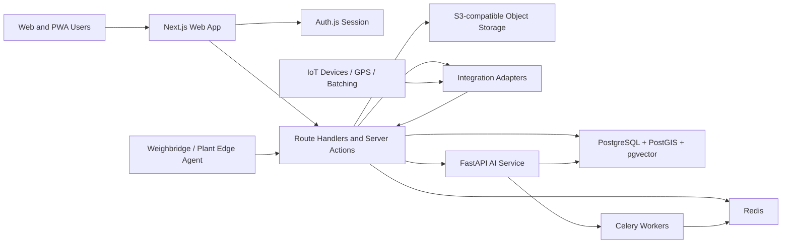

# CrusherMitra AI System Design

## 1. Repository Assessment

Current workspace: `C:\Users\Amit Jadhav\Documents\New project`.

The repository already contains a Phase 1-style scaffold: root workspace configuration, `apps/web`, `apps/ai-service`, `apps/worker`, shared packages under `packages/`, Docker Compose, initial SQL migrations, seed SQL, architecture documents, and early helper tests.

Reusable code exists in `packages/domain`, `packages/permissions`, `packages/validation`, `packages/ui`, `packages/i18n`, and the service shells. This scaffold should be preserved and matured incrementally.

Important caveat: the scaffold is not production-complete. Dependency installation, database migration execution, full authentication, live tenant and plant selection, comprehensive RLS coverage, CI verification, and critical workflow tests remain Phase 1 work.

See `docs/architecture/phase-0-assessment.md` for the detailed Phase 0 repository assessment, gaps, risks, and assumptions.

## 2. Product Context

CrusherMitra AI is a multi-tenant SaaS ERP and AI operations platform for Indian stone-crusher, quarry, aggregate-supply, transport, and Ready-Mixed Concrete businesses.

Primary users include owners, plant managers, operators, weighbridge users, dispatch teams, accountants, QC engineers, maintenance teams, drivers, customers, suppliers, compliance consultants, and platform administrators.

The product must be mobile-first, sunlight-readable, simple for non-technical operators, strict about tenant isolation, and safe around AI recommendations, industrial equipment, stock, money, weighments, and compliance records.

## 3. Proposed Monorepo Architecture

Target repository layout:

```text
crushermitra-ai/
  apps/
    web/
    ai-service/
    worker/
  packages/
    ui/
    database/
    validation/
    config/
    auth/
    permissions/
    i18n/
    integrations/
    reporting/
    domain/
  infrastructure/
    docker/
    scripts/
  docs/
    architecture/
    api/
    database/
    workflows/
    compliance/
    deployment/
  tests/
  AGENTS.md
  README.md
  docker-compose.yml
  .env.example
```

### Applications

- `apps/web`: Next.js App Router, React, TypeScript, Tailwind CSS, shadcn/ui, Auth.js, server actions, route handlers, PWA support, and operator-friendly mobile screens.
- `apps/ai-service`: FastAPI service for AI assistant, industrial calculations, anomaly baselines, document retrieval, and model/prediction APIs.
- `apps/worker`: Background jobs that do not require Python. Python-specific jobs should run through Celery workers owned by `apps/ai-service`.

### Shared Packages

- `packages/ui`: Accessible reusable components such as DataTable, FilterBar, StatusBadge, ApprovalPanel, AuditTimeline, and mobile action surfaces.
- `packages/database`: Prisma or Drizzle schema, migrations, seed helpers, tenant context helpers, and typed repository primitives.
- `packages/validation`: Zod schemas shared by UI, route handlers, and server actions.
- `packages/config`: Typed environment parsing and feature flags.
- `packages/auth`: Auth.js configuration, session enrichment, password policies, and OTP-ready interfaces.
- `packages/permissions`: Role, permission, policy, and authorization helpers.
- `packages/i18n`: next-intl messages for English, Hindi, Marathi, and prepared namespaces for Gujarati, Kannada, Telugu, and Tamil.
- `packages/integrations`: Provider interfaces for maps, WhatsApp, SMS, email, GPS, weighbridge, batching, storage, malware scanning, and webhooks.
- `packages/reporting`: Export, print layout, report definitions, and scheduled reports.
- `packages/domain`: Pure TypeScript domain calculations for units, GST, stock, material balance, weighment, credit, cost, and approval rules.

## 4. Architectural Principles

1. Keep UI components presentational and move business behavior into services, repositories, and domain packages.
2. Validate all inputs with Zod in the web app and Pydantic in the AI service.
3. Resolve organisation and plant context from the authenticated server session, never from client-provided IDs.
4. Put permission checks in server code and database policies, not only in hidden UI.
5. Use immutable ledgers for stock, audit, weighment corrections, financial balances, AI tool calls, and sensitive approvals.
6. Make important approved records immutable except through correction workflows.
7. Use database transactions for stock, weighment, invoices, receipts, payments, transfers, and approval state transitions.
8. Make offline writes idempotent with client-generated IDs and conflict detection.
9. Treat AI as advisory. AI may create drafts and recommendations, but cannot directly alter machine state, approved mix designs, legal compliance status, or commercial commitments.

## 5. Runtime Architecture



## 6. Frontend Design Direction

The product should feel like a professional industrial operations system, not a marketing page. The first screens should prioritize dense but readable operational information, large touch targets, clear labels, strong contrast, and reliable forms.

Desktop navigation:

- Collapsible sidebar.
- Top bar with organisation selector, plant selector, global date range, search, notifications, AI assistant, and profile.

Mobile navigation:

- Bottom navigation for Dashboard, Orders, Dispatch, Operations, and More.
- Floating AI assistant button.
- Large controls for weighbridge, production, dispatch, and driver workflows.

Every major screen must handle loading, empty, success, error, permission-denied, offline, and sync-pending states.

## 7. Application Module Boundaries

Core modules:

- Identity and tenancy.
- Organisation onboarding.
- Plant setup.
- Masters.
- Purchases.
- Inventory ledger.
- Crusher production.
- RMC production.
- Weighbridge.
- Dispatch.
- Fleet and GPS.
- Quality.
- Maintenance.
- Finance.
- Compliance.
- Documents.
- Notifications.
- Reports.
- AI assistant.
- Integrations.
- Platform SaaS billing.

Each module should expose:

- Validation schemas.
- Repository functions.
- Service methods.
- Permission policies.
- Audit events.
- UI screens.
- Tests.

## 8. API Design

All public application APIs should be versioned under `/api/v1`.

Domain groups:

- `/api/v1/auth`
- `/api/v1/organisations`
- `/api/v1/plants`
- `/api/v1/users`
- `/api/v1/customers`
- `/api/v1/suppliers`
- `/api/v1/products`
- `/api/v1/purchases`
- `/api/v1/production`
- `/api/v1/rmc`
- `/api/v1/inventory`
- `/api/v1/weighbridge`
- `/api/v1/orders`
- `/api/v1/dispatch`
- `/api/v1/vehicles`
- `/api/v1/quality`
- `/api/v1/maintenance`
- `/api/v1/finance`
- `/api/v1/compliance`
- `/api/v1/documents`
- `/api/v1/reports`
- `/api/v1/ai`
- `/api/v1/integrations`
- `/api/v1/devices`
- `/api/v1/notifications`

API responses should include a consistent error format, request ID, pagination metadata where relevant, and audit metadata for sensitive records.

## 9. Integration Architecture

Provider adapters should hide external details from business workflows.

Adapter categories:

- Maps: Google Maps or Mapbox.
- Storage: S3-compatible object storage.
- Email.
- SMS.
- WhatsApp Business API.
- Push notifications.
- Payment and billing provider, if added later.
- GPS providers.
- Weighbridge indicators and edge agents.
- Batching PLC or CSV import.
- Industrial sensors through MQTT, Modbus, OPC UA, HTTP, webhooks, or CSV import.
- Malware scanning.
- Error monitoring.

Integration records should be organisation-scoped, plant-scoped when needed, encrypted where credentials are stored, and audited.

## 10. Offline Synchronisation Design

Offline-capable features:

- Weighbridge capture.
- Basic dispatch.
- Production entry.
- Delivery proof.
- Machine readings.
- Driver updates.

Design:

- Client creates ULID/UUID identifiers.
- Every offline write includes an idempotency key.
- Local queue stores operation type, payload, user, organisation, plant, timestamp, and dependency references.
- Sync endpoint validates permission and tenant context when the request reaches the server.
- Server rejects stale writes that conflict with approved or corrected records.
- Conflicts create explicit resolution tasks; the system must not silently overwrite data.
- Sync status is visible in UI and audit logs.

## 11. Edge Agent Design

The weighbridge edge agent should run near the hardware computer and provide:

- Serial RS-232, RS-485, TCP/IP, Modbus, CSV, vendor API, and simulator drivers.
- Stable-weight detection.
- Duplicate-read prevention.
- Local durable queue during internet failure.
- Signed requests with device ID.
- Device heartbeat and health status.
- Remote configuration behind secure approval.
- Local logs for support.

The edge agent should submit readings as raw observations. Business records should be created server-side after validation, permission checks, and tenant checks.

## 12. AI Safety Design

AI features should use a safe tool registry with explicit read-only and draft-write tools.

Allowed:

- Explain dashboards.
- Summarize stock, dispatch, quality, maintenance, compliance, and sales data.
- Draft orders, reminders, tasks, and recommended actions.
- Flag anomalies for human review.
- Retrieve organisation-scoped documents with source references.

Forbidden:

- Arbitrary SQL execution.
- Cross-tenant data access.
- Directly changing concrete mix designs.
- Starting or stopping machinery.
- Declaring legal compliance as final.
- Committing commercial terms through WhatsApp without human approval.
- Editing approved weighments, invoices, payments, stock, or mix designs without controlled correction workflows.

Every AI conversation, message, tool call, source, recommendation, feedback signal, and approval decision must be logged.

## 13. Initial File And Folder Plan

The requested monorepo folders already exist and should remain the foundation:

- `apps/web`
- `apps/ai-service`
- `apps/worker`
- `packages/ui`
- `packages/database`
- `packages/validation`
- `packages/config`
- `packages/auth`
- `packages/permissions`
- `packages/i18n`
- `packages/integrations`
- `packages/reporting`
- `packages/domain`
- `infrastructure/docker`
- `infrastructure/scripts`
- `docs/architecture`
- `docs/workflows`

Phase 1 should continue from the existing scaffold by wiring the runtime, executing migrations, completing authentication and tenant context, expanding tests, and verifying commands. It should not restart the repository from scratch.

## 14. Risks And Assumptions

Risks:

- The requested scope is large and must be delivered incrementally by phase.
- Industrial hardware integration will vary by local vendors and may require field testing.
- Compliance requirements vary by country, state, district, mineral type, plant type, consent type, and local authority.
- Offline workflows can create conflicts unless idempotency and immutable records are designed from the start.
- Poor tenant isolation would be a critical SaaS failure.
- AI features can create safety and liability risk if they appear authoritative.

Assumptions:

- PostgreSQL is the source of truth.
- Redis is available for queues, rate limits, and cache.
- Object storage is available for documents and images.
- Production deployments will use managed secrets, managed backups, HTTPS, and external monitoring.
- Phase 1 can choose exact TypeScript ORM after evaluating maturity, RLS support, migration workflow, and team preference.
