# CrusherMitra AI Core Workflows

## 1. Organisation Onboarding

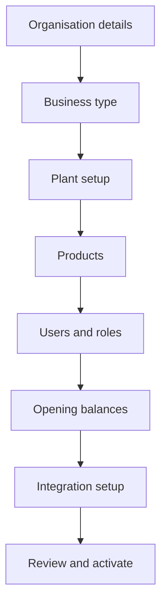

Validation:

- PAN, GSTIN, mobile, pincode, and financial year are validated.
- Plant code and product code are unique within the organisation.
- Opening balances create stock and ledger entries through controlled workflows.
- Invitations create audit logs.

## 2. Crusher Production Workflow

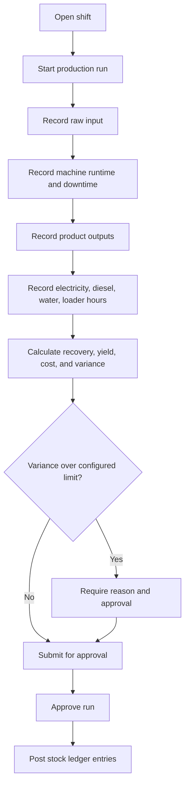

Rules:

- Raw stock consumption and finished output creation happen through inventory transactions.
- Material-balance variance is displayed, not silently forced.
- Approved production runs are immutable except through correction workflows.
- Energy and diesel costs are calculated from configured cost sources.

## 3. RMC Production Workflow

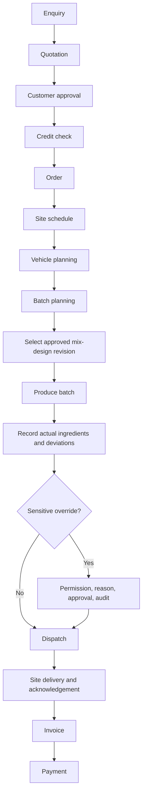

Rules:

- Approved mix designs are versioned and immutable.
- Every batch records selected mix-design revision.
- Manual water, admixture, mix-design, or quantity overrides require permission, reason, approver, timestamp, original value, and changed value.
- Batch ingredient consumption posts inventory transactions.

## 4. Quarry And Raw-Material Purchase Workflow

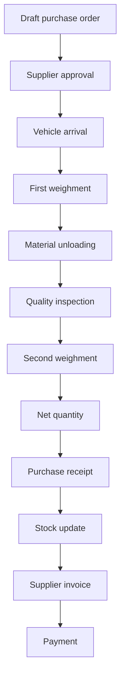

Controls:

- Duplicate royalty/transit pass alerts.
- Suspicious source alerts.
- Photos and documents stored securely.
- OCR or document extraction creates drafts that require approval.

## 5. Weighbridge Workflow

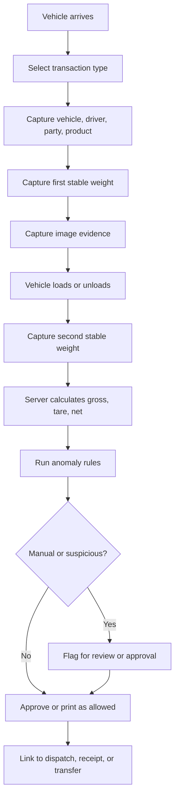

Integrity controls:

- Stable weight detection.
- Duplicate-read prevention.
- Device signing.
- Image evidence.
- Print count tracking.
- Correction workflow with original and corrected values.

## 6. Inventory Workflow

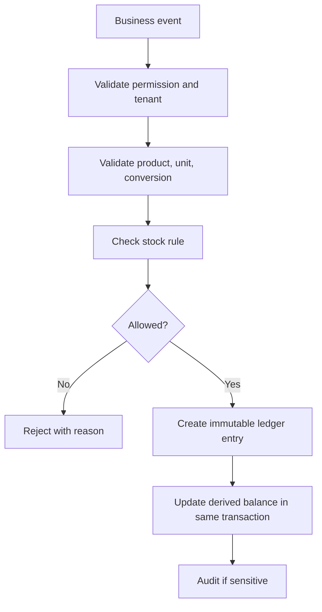

Business events include purchase receipts, crusher consumption, crusher output, RMC consumption, sale dispatch, transfer issue/receipt, stock adjustment, physical count correction, returns, and wastage.

## 7. Sales, Dispatch, And Finance Workflow

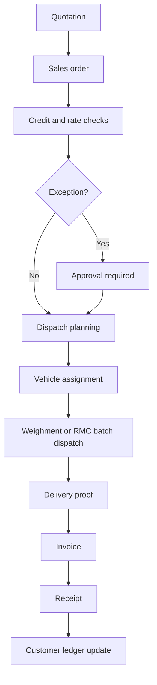

Rules:

- Rate overrides require approval.
- Credit-limit exceptions require approval.
- Dispatch reduces inventory.
- Invoice and receipt update customer balance through financial ledger entries.

## 8. Quality Workflow

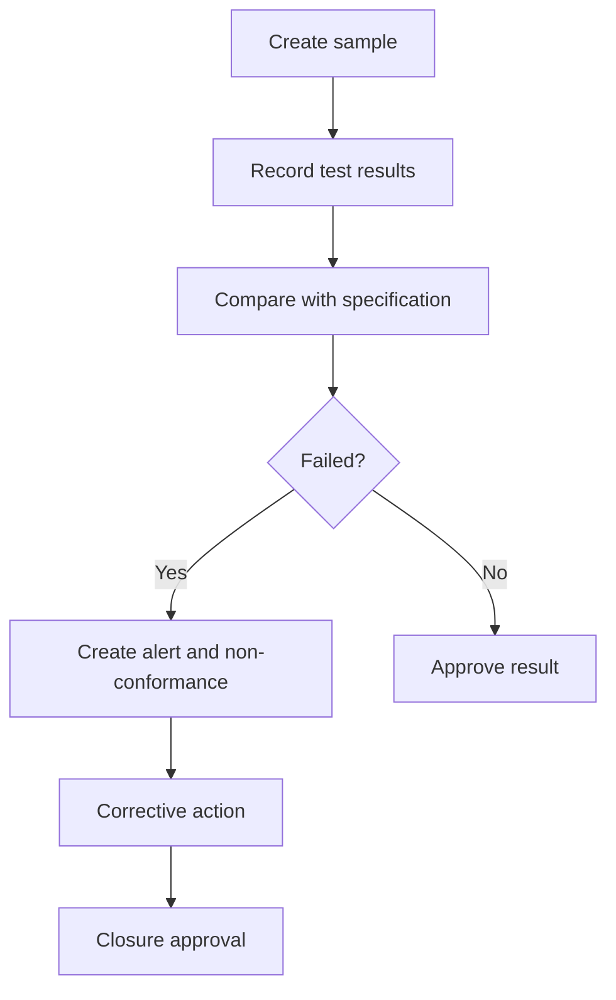

Quality tests must be configurable and linked to product, concrete grade, customer, plant, and specification where relevant.

## 9. Maintenance Workflow

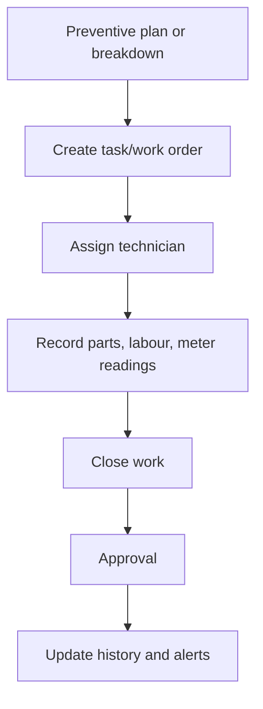

Rules:

- Work orders can consume spare parts.
- Breakdowns record downtime and root cause.
- Preventive tasks can be generated automatically.

## 10. Compliance Workflow

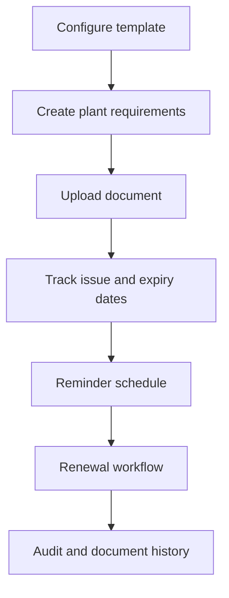

Rules:

- Compliance templates are configurable by geography and plant type.
- The system tracks requirements and reminders but does not provide final legal certification.
- Compliance consultant actions are permissioned and audited.

## 11. WhatsApp Order Workflow

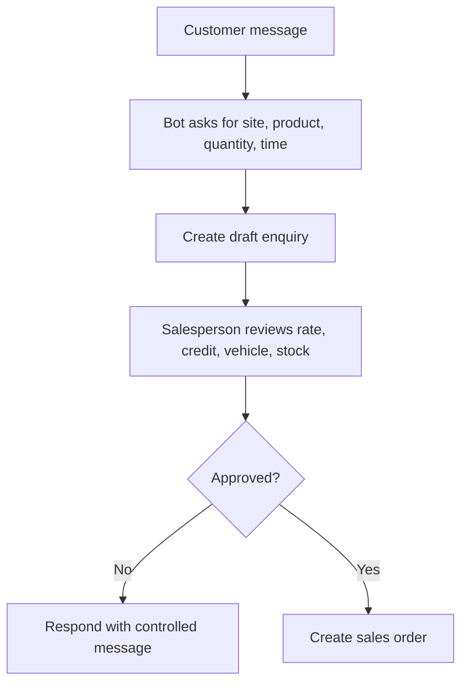

Rules:

- The bot cannot commit commercial terms without configured approval.
- All messages and draft actions are organisation-scoped and logged.

## 12. AI Assistant Workflow

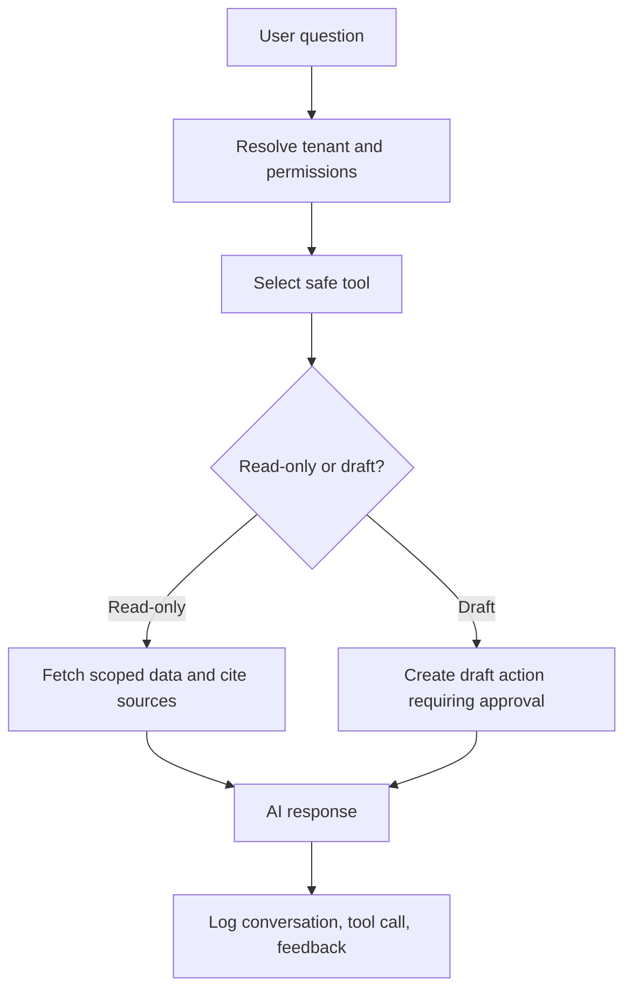

Rules:

- AI estimates are labelled.
- Missing data is not invented.
- AI cannot execute arbitrary SQL.
- AI cannot access another tenant.
- Sensitive actions require human confirmation.

## 13. Hardware And IoT Workflow

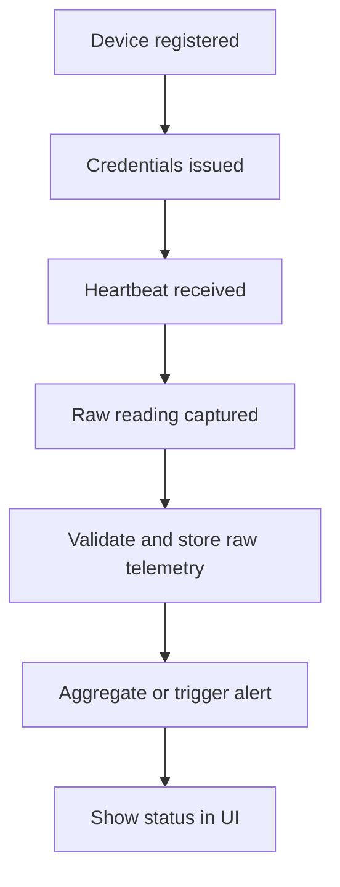

Rules:

- Raw telemetry is append-only.
- Calibration details and source status are visible.
- Low-cost environmental sensors are not treated as official compliance devices unless configured and verified.

## 14. Offline Synchronisation Workflow

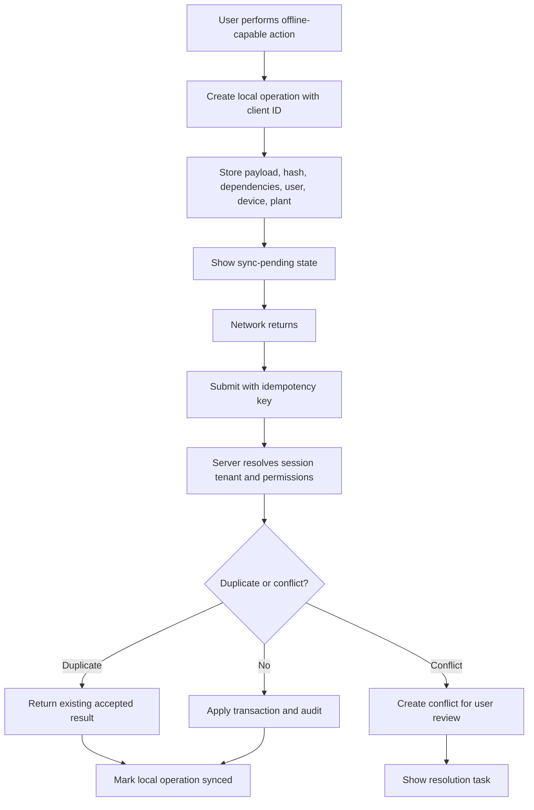

Rules:

- Offline records use client-generated IDs and idempotency keys.
- Sync never trusts locally stored organisation context without authenticated server validation.
- Approved or corrected records cannot be silently overwritten.
- Every failed sync keeps enough detail for retry, support, and audit.

## 15. Integration Event Workflow

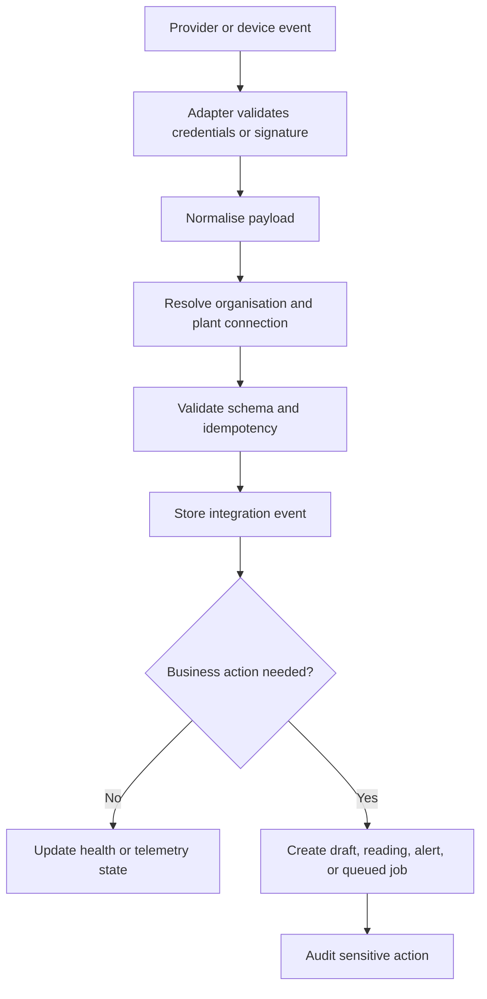

Rules:

- Credentials are encrypted and redacted from logs.
- Raw telemetry and integration events are append-only where practical.
- Provider-specific details stay behind adapter interfaces.
- Hardware readings become business records only after server-side validation and tenant checks.
